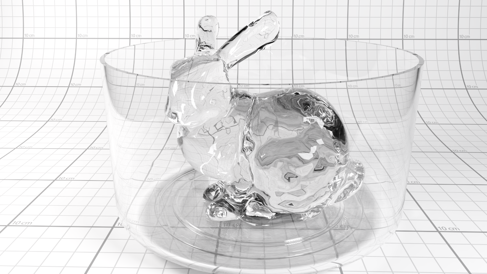
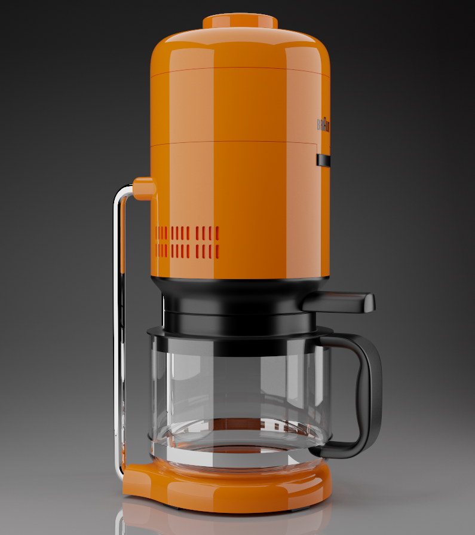
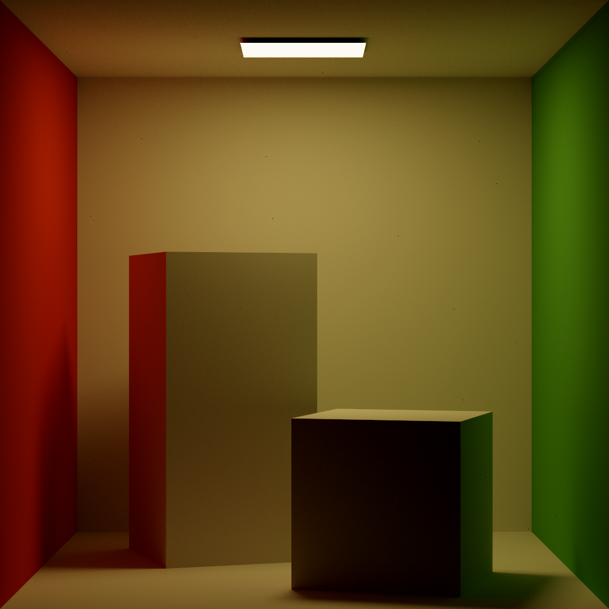
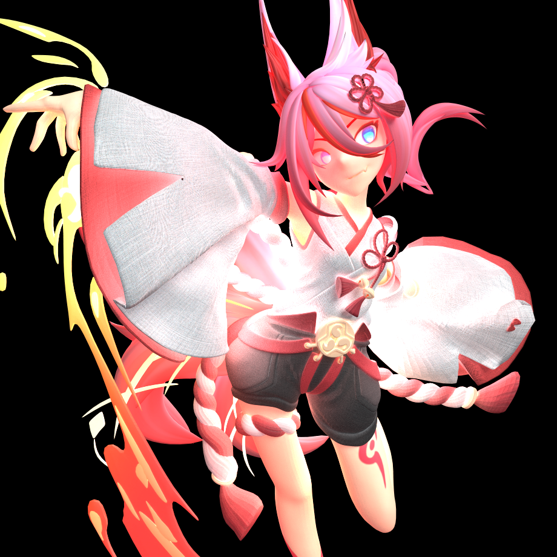
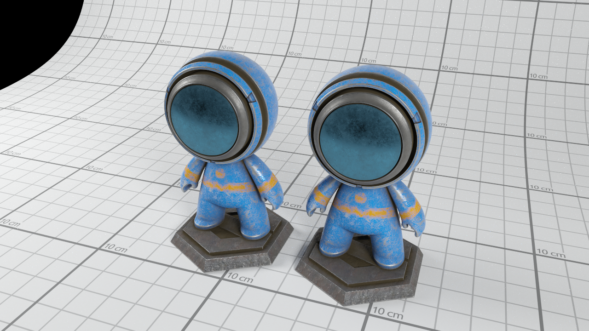
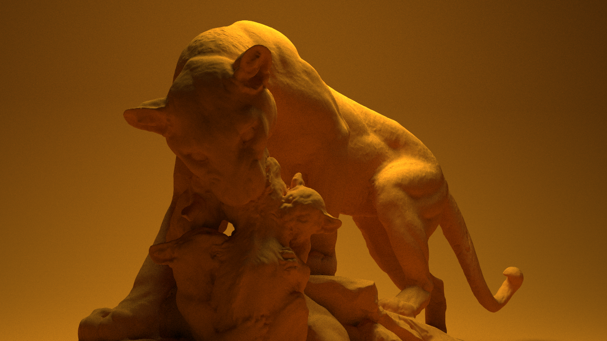

# Asuna

Asuna is a renderer base on vulkan ray tracing pipeline with NVIDIA card.

| Documentation   |
|      :---:      |
| [![docs][1]][2] |

[1]: https://img.shields.io/badge/docs-passing-brightgreen
[2]: https://github.com/f1shel/Asuna/wiki/Home

## Gallery

## Features

+ GPU-accelerated ray tracing (in vulkan rtx favor)
+ Path integrator with direct illumination
+ Multiple importance sampling (BxDF and Light)
+ Optix denoiser
+ Multiple channel buffer (radiance/albedo/normal/depth/etc)
+ Online GUI & offline rendering
+ One camera & Multiple shots (different position&lookat)
+ Json scene file description
+ Physically based materials
  + BRDFs
    + brdf_mirror (bug to be fixed?)
    + brdf_lambertian
    + brdf_emissive
    + brdf_pbr_metalness_roughness
    + brdf_conductor (bug to be fixed?)
    + brdf_plastic
    + brdf_rough_plastic
    + brdf_kang18
    + brdf_disney (bug to be fixed?)
  + BSDFs
    + bsdf_dielectric
+ Fundamental light sources
  + Area light
    + Mesh (auto-converted to triangle light)
    + Triangle
    + Rectangle
    + Image based environment light
    + Sun and sky
  + Delta light
    + Directional light
    + Point light
+ Fundamental camera model
  + Perspective camera with aperture and focal distance
  + Pinhole camera with opencv-style extrinsic/intrinsic parameters
+ IO
  + Scene description file `.json`
  + Mesh file `.obj`
  + Texture/Image `.hdr/.exr/.jpg/.png/.bmp/.tga`
  + Output `.hdr/.exr/.jpg/.png/.bmp/.tga`
