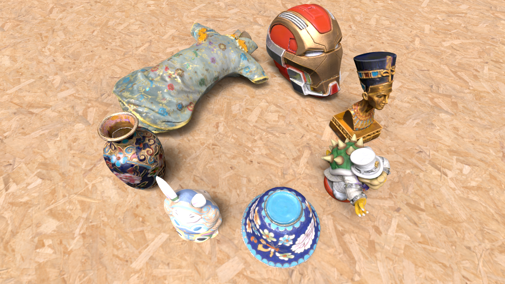

# Asuna
Asuna is a renderer base on vulkan ray tracing pipeline with NVIDIA card.

**还有无数个bug和todo，累了以后有空再写吧**

## Gallery

<div>
<center>

</center>
</div>

<div>
<center>

</center>
</div>

<div>
<center>

</center>
</div>

<div>
<center>


</center>
</div>

<div>
<center>

</center>
</div>

<div>
<center>

</center>
</div>

<div>
<center>

</center>
</div>

## Features

+ GPU-accelerated ray tracing (in vulkan rtx favor)
+ Path integrator with direct illumination
+ Multiple importance sampling (BxDF and Light)
+ Optix denoiser
+ Multiple channel buffer (radiance/albedo/normal/depth/etc)
+ Online GUI & offline rendering
+ One camera & Multiple shots (different position&lookat)
+ Json scene file description
+ Physically based materials
  + BRDFs
    + brdf_mirror (bug to be fixed?)
    + brdf_lambertian
    + brdf_emissive
    + brdf_pbr_metalness_roughness
    + brdf_conductor (bug to be fixed?)
    + brdf_plastic
    + brdf_rough_plastic
    + brdf_kang18
    + brdf_disney (bug to be fixed?)
  + BSDFs
    + bsdf_dielectric
+ Fundamental light sources
  + Area light
    + Mesh (auto-converted to triangle light)
    + Triangle
    + Rectangle
    + Image based environment light
    + Sun and sky
  + Delta light
    + Directional light
    + Point light
+ Fundamental camera model
  + Perspective camera with aperture and focal distance
  + Pinhole camera with opencv-style extrinsic/intrinsic parameters
+ IO
  + Scene description file `.json`
  + Mesh file `.obj`
  + Texture/Image `.hdr/.exr/.jpg/.png/.bmp/.tga`
  + Output `.hdr/.exr/.jpg/.png/.bmp/.tga`

## Dependencies

+ C++ compiler. `MSVC 19.31.31105` and `gcc 9.4.0` was tested.
+ [CMake](https://cmake.org/download/). `Version 3.16` was tested.
+ [NVIDIA driver](https://www.nvidia.com/Download/index.aspx). Should be released on or after December 15th, 2020, for the implementations of the new official versions of the Vulkan ray tracing extensions. `RTX 3060 Ti` with Driver `Version 512.15` was tested. *Whether this project supports non NVIDIA graphics cards has not been determined.*
+ [Vulkan SDK](https://vulkan.lunarg.com/). `Version 1.3.204.1` was tested.
+ [OptiX 7](https://developer.nvidia.com/designworks/optix/download). `Version 7.4.0` was tested.

## Compile

```bash
$ git clone git@github.com:f1shel/Asuna.git --recursive
$ mkdir Asuna/build
$ cd Asuna/build
$ cmake ..
$ make # or build in IDE on windows
```

The binary file is placed in the `Asuna/bin_x64` folder.

## Docker

One can compile Asuna in the docker. The Dockerfile is placed in `Asuna/docker` and you can build image with following command:

```bash
$ cd Asuna/docker
$ docker build --pull --tag "asuna:latest" --file Dockerfile .
```

To start image you can type:

```bash
docker run --rm -it \
    --runtime=nvidia \
    -e NVIDIA_DRIVER_CAPABILITIES=all \
    asuna:latest /bin/bash
```

Note that `nvidia-container-toolkit` is required for accessing GPU in the docker.

## Documentation

### Usage

```bash
$ ./asuna.exe --scene scenes/cornell_box/scene.json [--offline] [--out cbox]
```

### Architecture

+ **Initializing**: window, surface, context, device, allocator

+ **Parsing scene**: interpret scene file and generate meta data

+ **Allocating scene resources**: convert meta data to gpu resources

+ **Building pipeline**

+ **Binding pipeline and resources**

+ **Rendering** 

```c++
class AsunaTracer : public AppBaseVk {
    class Context; ----------------|
    class Scene;   ----------|     |
    class Pipeline;   <------|-----|
    void run();
};
```

  

